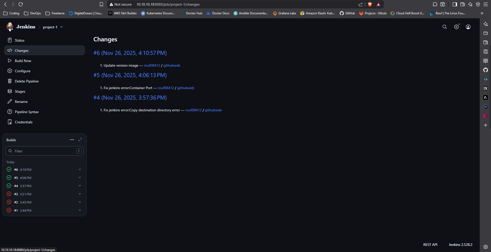
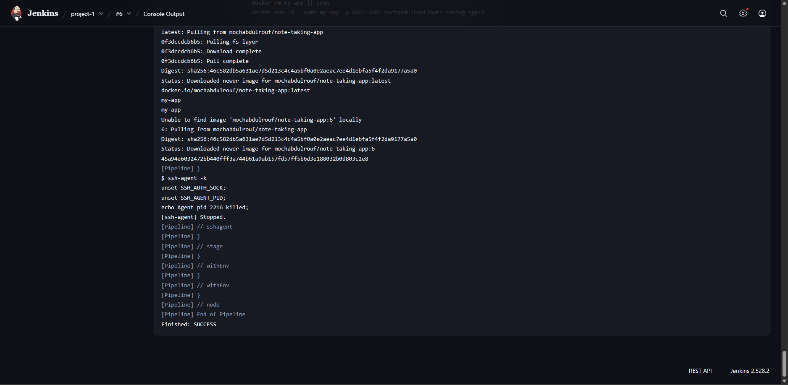
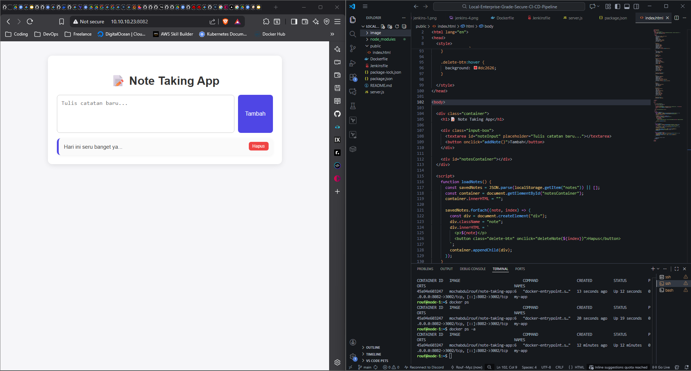
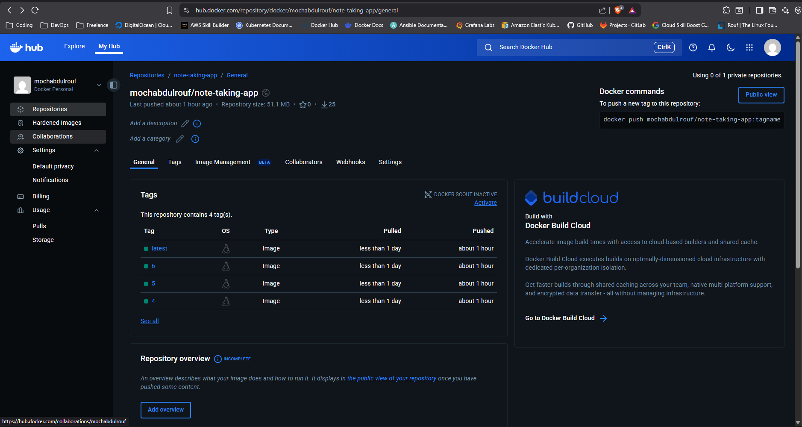

# Local-Enterprise-Grade-Secure-CI-CD-Pipeline
Proyek ini mencakup fase Code Integration, Quality Inspection, Security Scanning, Containerization, hingga Automated Deployment ke server produksi yang terpisah.


## Implementasi project yang saya lakukan

1. disini saya menggunakan 2 vm local, jadi di 2 vm tersebut saya install docker terlebih dahulu untuk mengoptimalkan resource tools aplikasi yang digunakan.Saya menginstallnya menggunakan script buatan saya supaya lebih cepat.
```bash
curl -LO https://raw.githubusercontent.com/MochamadAbdulRouf/Hands-on-Bash-Script-Labs/refs/heads/master/install-docker/setup-docker.sh

chmod +x setup-docker.sh

./setup-docker.sh
```

2. Di kedua vm masukan command berikut, Supaya tidak menggunakan command sudo untuk docker.
```bash
newgrp docker 
```

### Langkah VM 1 / Master Node
3. SonarQube menggunakan elastic search dibelakang layar, Yang membutuhkan memory virtual map yang besar.Jalankan command berikut
```bash
# Edit konfigurasi sysctl
echo "vm.max_map_count=262144" | sudo tee -a /etc/sysctl.conf
# Terapkan perubahan
sudo sysctl -p
```

4. Setup network Docker 
```bash
docker network create devops-net
```

5. Installasi dan Menjalankan SonarQube menggunakan Docker
- note: Jalankan SonarQube dulu karena butuh waktu booting yang lama
```bash
docker run -d \
    --name sonarqube \
    --network devops-net \
    -p 9000:9000 \
    sonarqube:lts-community
```

6. Cek logs langsung dari container SonarQube sampai terdapat logs seperti berikut `SonarQube is operational`

7. Installasi dan Menjalankan Jenkins
```bash
docker run -d \
  --name jenkins \
  --network devops-net \
  --restart=on-failure \
  -p 8080:8080 -p 50000:50000 \
  -v jenkins_home:/var/jenkins_home \
  -v /var/run/docker.sock:/var/run/docker.sock \
  -v $(which docker):/usr/bin/docker \
  jenkins/jenkins:lts
```
note:
- -v jenkins_home:/var/jenkins_home: Menyimpan data Jenkins agar tidak hilang saat container mati.
- -v /var/run/docker.sock:/var/run/docker.sock: Kunci Utamanya. Ini meminjamkan "soket" Docker VM Host ke dalam container Jenkins. Sehingga saat Jenkins mengetik perintah docker build, yang bekerja adalah Docker di VM Host.
- -v $(which docker):/usr/bin/docker: Meminjamkan file binary (program) docker ke Jenkins.

8. Mengambil password jenkins di container 
```bash
docker exec -it jenkins bash

cat /var/jenkins_home/secrets/initialAdminPassword
```
note: salin password tersebut

9. Buka Browser masukan ip vm dengan port 8080 setelah itu masukan password yang telah disalin --> Install plugin pilih `install suggested plugins` tunggu proses selesai --> masukan username dan password bebas --> klik menu manage jenkins dengan icon setting disebelah kanan layar samping kiri icon profile --> klik menu Plugins --> Klik Available Plugins install plugin berikut 
- Docker (oleh Docker, Inc.)
- Docker Pipeline
- SonarQube Scanner
- SSH Agent (untuk deploy ke VM-2 nanti)
--> setelah plugins di atas di centang klik install --> Klik `Restart Jenkins when installation is complete`

10. Generate SSH Key, Generate SSH key didalam container jenkins bukan di host karena yang melakukan ssh nanti adalah Jenkins yang ada didalam container
```bash
docker exec -it jenkins bash

ssh-keygen -t rsa -b 4096 -f /var/jenkins_home/.ssh/id_rsa -N ""

# Salin Public Key nya
# Salin outputnya mulai dari ssh-rsa...
cat /var/jenkins_home/.ssh/id_rsa.pub
```
Di VM 1 atau Master Node.
Saat ini, VM-1 sudah memiliki status:
- Docker terinstall dan running.
- Network Bridge Docker devops-net aktif.
- SonarQube running di port 9000.
- Jenkins running di port 8080.
- Jenkins punya akses ke Docker Host (via socket).
- SSH Key sudah dibuat di dalam Jenkins.
Jika membuka browser http://<IP-VM-1>:8080 (Jenkins) dan http://<IP-VM-1>:9000 (SonarQube), keduanya harusnya sudah bisa dibuka.

### Langkah VM 2 / Node 1

11. Lakukan SSH Key di host
```bash
# Jika ada pertanyaan kosongkan dan enter saja
ssh-keygen -t rsa
```

12. Edit file `authorized_keys` Paste Public Key dari container Jenkins --> lalu simpan file 
```bash
vi .ssh/authorized_keys
```

13. Lalu Restart ssh
```bash
sudo systemctl restart ssh 
```

14. Set permission supaya Jenkins bisa langsung login ke vm 2 atau node 1 tanpa menggunakan password
```bash
chmod 700 ~/.ssh
chmod 600 ~/.ssh/authorized_keys
```

15. Setup firewall (opsional namun disarankan)
```bash
sudo ufw allow ssh

sudo ufw allow 3000/tcp  # Jika app running di port 3000
sudo ufw allow 80/tcp    # Jika app running di port 80

sudo ufw enable
# Tekan 'y' jika ditanya konfirmasi
```

16. Di VM 1 masuk ke container Jenkins dan Coba ssh ke vm 2 ganti user dan ip vm 2 dengan konfigurasi yang tercatat di VM 2
```bash
docker exec -it jenkins bash

ssh -o StrictHostKeyChecking=no <user>@<IP-VM-2>

# example 
ssh -o StrictHostKeyChecking=no rouf@10.10.10.23
```
note: 
- jika masuk ke vm tanpa menggunakan password artinya konfigurasi berhasil
- jika masuk ke vm menggunakan password artinya belum berhasil coba cek isi file `authorized_keys` pastikan isi `public_key` container jenkins sama dan tidak ada typo
- jika `connection_refused` cek ip address atau firewall


### VM 1 / Master Node

17. Pastikan sudah memiliki code aplikasi yang telah dibuat
18. Berikan izin container jenkins untuk mengakses Docker Socket 
```bash
sudo chmod 666 /var/run/docker.sock
```

19. Buat automation CI/CD Pipeline menggunakan Jenkins seperti di file `Jenkinsfile`
20. Pastikan setelah itu sudah Melakukan push ke repo github atau bisa gunakan repo saya ini untuk uji coba implementasi
21. Menambahkan Credentials ke Jenkins supaya Jenkins memiliki akses ke Docker Hub dan Login SSH ke VM-2
22. Buka Dashboard Jenkins (http://<IP-VM-1>:8080) -> Manage Jenkins -> Credentials -> System -> Global credentials (unrestricted) -> Add Credentials.
23. Tambah credentials: Docker Hub
- Kind: Username with password
- Scope: Global
- Username: (Username Docker Hub Anda)
- Password: (Password Docker Hub Anda)
- ID: docker-hub-login (Harus sama persis dengan yang di Jenkinsfile)
- Description: Akun Docker Hub (optional)
- Klik Create.
24. Menambahkan Credentials untuk SSH Key ke VM-2
- Mengambil Private Key dari Container Jenkins dulu
```bash
docker exec jenkins cat /var/jenkins_home/.ssh/id_rsa
```
- Kembali ke Browser Jenkins (Add Credentials lagi):
- Kind: SSH Username with private key
- Scope: Global
- ID: vm2-ssh-key (Harus sama persis dengan yang di Jenkinsfile)
- Username: (Username user di VM-2, misal ubuntu atau nama user anda)
- Private Key: Pilih Enter directly -> Tekan Add -> Paste teks key yang tadi dicopy.
- Passphrase: (Kosongkan jika saat generate key anda tidak isi password).
- Klik Create.
25. Membuat Job Pipeline
- Di Dashboard Jenkins, klik New Item.
- Masukkan nama: Project-1 (example).
- Pilih Pipeline. Klik OK.
- Scroll ke bawah bagian Pipeline Definition:
- Pilih Pipeline script from SCM.
- SCM: Git.
- Repository URL: Masukkan Link GitHub Repo (misal: https://github.com/MochamadAbdulRouf/Local-Enterprise-Grade-Secure-CI-CD-Pipeline).
- Branch Specifier: */main (atau */master tergantung di repo).
- Script Path: Jenkinsfile (biarkan default).
- Klik Save.
26. Menjalankan Pipeline
- Kembali ke menu Project pipeline
- Di menu sebelah kiri klik button `Build Now`
- Di Bagian kiri bawah menu credentials akan ada history Build klik icon panah yang mengarah ke bawah 
- Lalu Klik `Console Output`
- Di situ akan terlihat progress Pipeline yang sedang berjalan secara live 

Example Documentation:
Successfuly Implementation Pipeline



